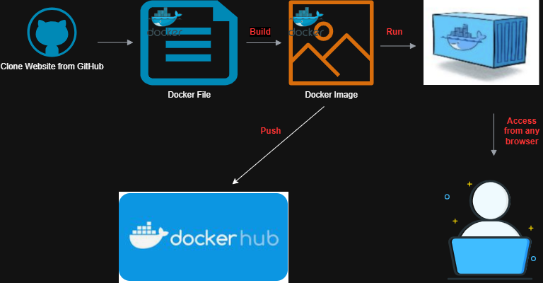
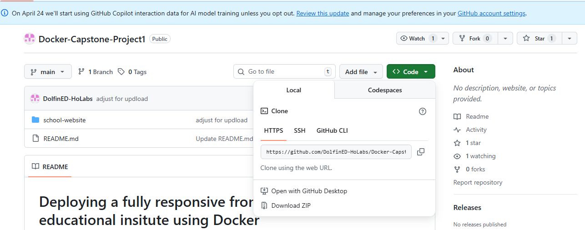
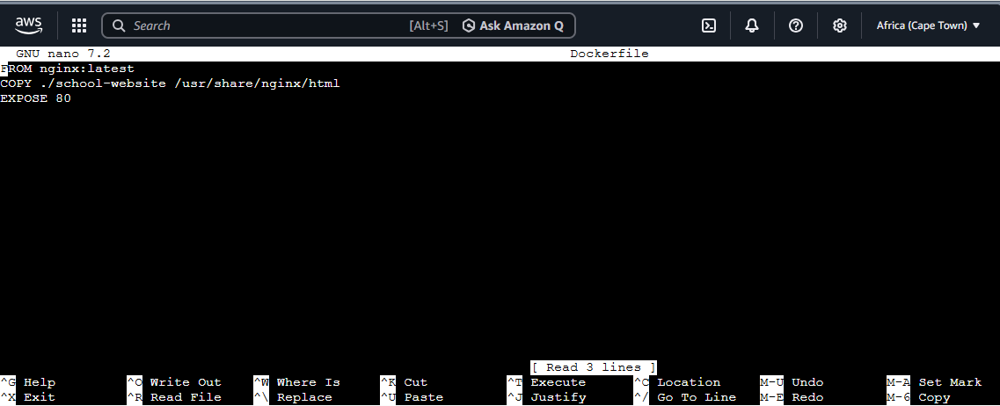
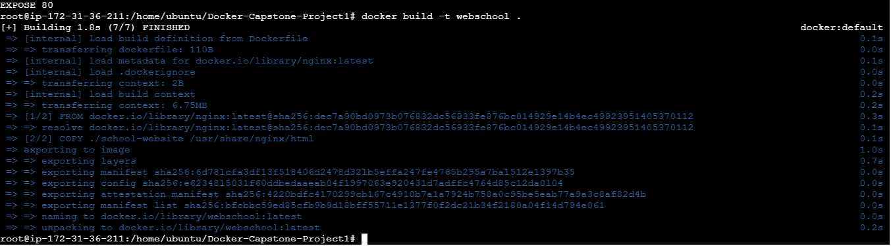
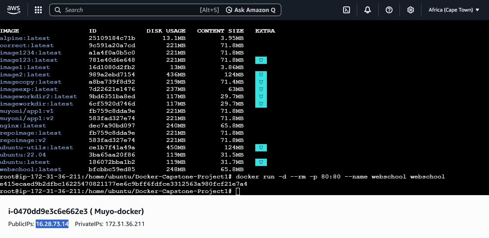
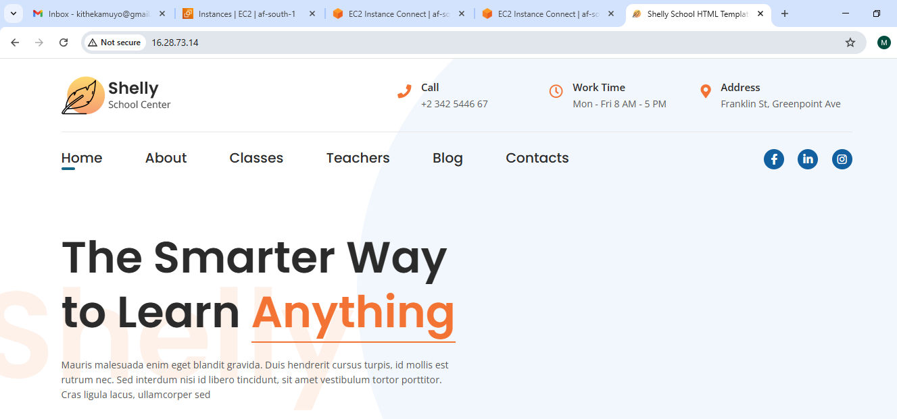

# Deploying a Website on Nginx Server using Docker on AWS

**Author:** Kathleen Muyoni
**Date:** April 12, 2026

---

### **Table of Contents**
1. [Project Overview](#project-overview)
2. 
3. [Prerequisites](#prerequisites)
4. [Step 1: Clone Website from Github](#step-1-clone-website-from-github)
5. [Step 2: Create Docker File](#step-2-create-docker-file)
6. [Step 3: Build Webschool Image](#step-3-build-webschool-image)
7. [Step 4: Containerize School Template](#step-4-containerize-school-template)
8. [Step 5: Build Docker Image](#step-5-build-docker-image)
9. [Step 6: Run the Container](#step-6-run-the-container)
10. [Step 7: Access the Website](#step-7-access-the-website)

---

### **Project Overview**
This project demonstrates how to deploy a static website on AWS using Docker and Nginx. The website files are cloned from GitHub, containerised using a Dockerfile, and served through an Nginx web server hosted on an AWS EC2 instance.

---

### **Architecture Diagram**



---

### **Prerequisites**
- AWS Account
- EC2 Instance running Ubuntu
- Docker installed
- Basic knowledge of Linux commands

## Step by Step Setup

### 1. Clone Website from GitHub
Clone the project from this repository:
[DolfinED HoLabs](https://github.com/DolfinED-HoLabs)



### 2. Create Docker File
Create the file inside the Docker-Capstone-Project1 Directory




### 3. Build Webschool Image
Use this command: docker build -t webschool



### 4. Containerize School Template
To check if the School Website is live
Run: docker run -d --rm -p 80:80 --name webschool webschool
Copy your Public IP address in the browser to check the website





### 5. Write Your Dockerfile
```dockerfile
FROM nginx
COPY index.html /usr/share/nginx/html/
```

### 6. Build Your Image
```bash
docker build -t my-website .
```

### 7. Run Your Container
```bash
docker run -d -p 80:80 my-website
```

### 8. Access Your Website
- Copy your EC2 Public IP
- Open in browser

  

